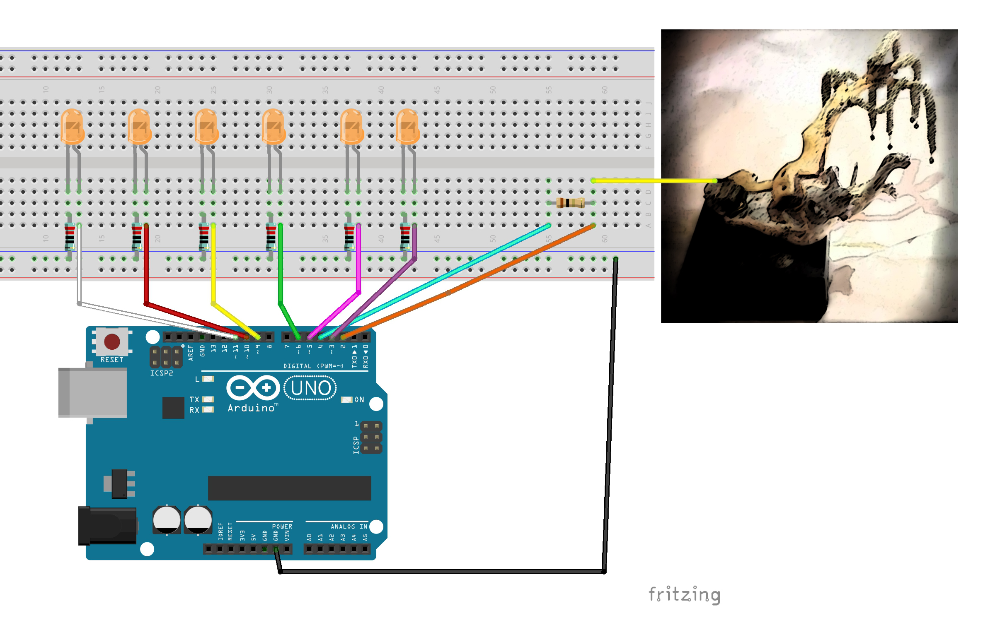

# tree-of-prosperity-and-flow

Gong Xi Fa Cai is an Arduino driven maker-artwork which includes you in its actions. The Arduino is wired to the golden pyrite stone on the top of a root. A steady flow of energy is running from the Arduino to the pyrite and back. If you touch the pyrite the circuit will be extended through your body and will absorb some of the energy. This process triggers to light up the golden LEDs on the foot of the installation and brings you luck!
Gong xi fa cai 恭喜发财 literally wishes you to enlarge your wealth. The pyrite is placed on a tree of wealth roots wishing you all prosperity for the coming year of the metal ox.

## How it works:
The artwork is a capacity sensor.

for a long and detailed describtion referr to:
https://playground.arduino.cc/Main/CapacitiveSensor/

for short:
"The capacitiveSensor method toggles a microcontroller send pin to a new state and then waits for the receive pin to change to the same state as the send pin. A variable is incremented inside a while loop to time the receive pin's state change. The method then reports the variable's value, which is in arbitrary units."
(Paul Badger)

## How to make it:
Build a capacitive sensor according to this describtion: 
You use a 1-megaohm resistor for the capacity sensor and 5 x 220-ohm resistors for the LED´s.

Get ore infos on my website:

https://baitishan.wordpress.com/2021/02/03/%e6%81%ad%e5%96%9c%e5%8f%91%e8%b4%a2-gong-xi-fa-cai/